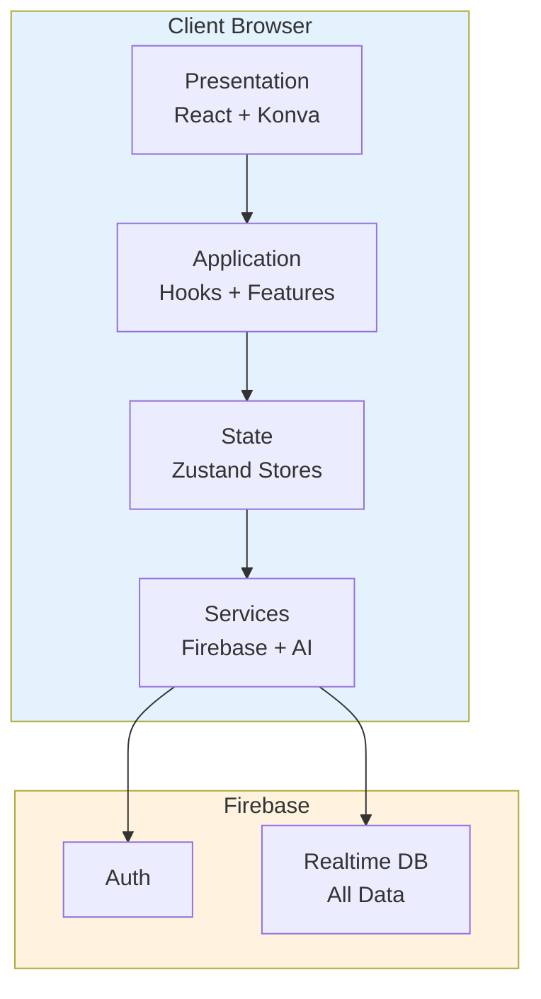

# CollabCanvas: System Architecture

**Version:** 1.0
**Purpose:** System design and architectural decisions
**Scope:** MVP → Full Product (Phases 1-3)

---

## Architecture Principles

**Style:** Vertical Slice Architecture (feature-based) from Phase 0
**File Size:** Max 500 lines per file
**Dependencies:** Features → Stores → Services (no circular dependencies)
**Exports:** Barrel exports via index.ts
**Imports:** Absolute with @ alias

**Note:** This project implements Vertical Slice Architecture from the beginning (Phase 0), not as a later refactor. Each feature is self-contained from day one.

---

## System Overview



**Layers:**
- **Presentation:** React components, Konva canvas
- **Application:** Custom hooks, business logic
- **State:** Zustand stores (canvas, auth, ui, ai)
- **Services:** Firebase SDK, AI API wrappers

---

## Component Architecture

**Implementation:** This structure is created in Phase 0 and maintained throughout all phases.

### Feature Modules (Vertical Slices)

Each feature is a self-contained vertical slice with its own components, hooks, and utilities.

```
src/features/
├── canvas-core/        # Canvas rendering & shapes (Phase 1+)
│   ├── components/     # CanvasStage, CanvasLayer, etc.
│   ├── shapes/         # Rectangle, Circle, Text components
│   ├── hooks/          # useCanvas, useShapes, etc.
│   └── utils/          # Canvas calculations, transformations
│   └── index.ts        # Barrel export
├── collaboration/      # Real-time multiplayer (Phase 1+)
│   ├── components/     # Cursor, PresenceList, etc.
│   ├── hooks/          # usePresence, useCursors, etc.
│   └── utils/          # Cursor calculations
│   └── index.ts        # Barrel export
├── toolbar/           # Tools & controls (Phase 1+)
│   ├── components/     # Toolbar, ToolButton, etc.
│   ├── hooks/          # useSelectedTool, etc.
│   └── index.ts        # Barrel export
├── auth/             # Authentication (Phase 1)
│   ├── components/     # AuthModal, LoginForm, SignupForm
│   ├── hooks/          # useAuth, useUser
│   └── utils/          # Auth helpers
│   └── index.ts        # Barrel export
└── ai-agent/         # AI commands (Phase 3)
    ├── components/     # AIPanel, AIChat, etc.
    ├── hooks/          # useAI, useCommands
    └── utils/          # AI parsing
    └── index.ts        # Barrel export
```

**Key Principles:**
- Each feature owns its domain logic
- No cross-feature imports (use stores/services instead)
- Feature-specific components live in the feature
- Shared/generic components go in `components/`

### Shared Components (Common Use Only)

Shared components are generic, reusable across ALL features.

```
src/components/
├── ui/              # shadcn/ui primitives (Button, Input, Dialog, etc.)
├── common/          # Truly generic components (Loading, Error, Empty state)
└── layout/          # Page layouts (AppLayout, CanvasLayout, etc.)

src/stores/              # Zustand stores (shared state)
├── canvasStore.ts
├── authStore.ts
├── uiStore.ts
└── aiStore.ts (Phase 3)

src/lib/                 # Services & utilities (infrastructure)
├── firebase/            # Firebase config and services
│   ├── config.ts
│   ├── auth.ts
│   ├── firestore.ts
│   └── realtimedb.ts
├── canvas/              # Canvas utilities
│   └── calculations.ts
└── utils/               # General utilities
    └── helpers.ts

src/types/               # Shared TypeScript types
src/constants/           # App constants
src/pages/              # Top-level route components
```

**Decision Rule:** "If only one feature needs it, it lives in that feature. If multiple features need it, it's shared."

---

## Data Flow Architecture


**Pattern:** Optimistic updates → Local state → Async sync → Broadcast

---

## State Management

### Zustand Stores

| Store | Purpose | Update Trigger |
|-------|---------|----------------|
| **canvasStore** | Canvas objects, selection | User actions |
| **authStore** | User authentication | Auth changes |
| **uiStore** | Modals, toasts | UI interactions |
| **aiStore** | AI messages (Phase 3) | AI commands |

**Design:** Multiple focused stores, not one monolith

---

## Real-Time Synchronization

### All Realtime Database Architecture

**Decision**: This project uses Firebase Realtime Database exclusively for all real-time data, including canvas objects. This differs from the typical Firestore + Realtime DB split.

| Service | Data | Frequency | Pattern |
|---------|------|-----------|---------|
| **Realtime DB** | Canvas objects | 50ms throttle | Persistent |
| **Realtime DB** | Cursors | 50ms throttle | Ephemeral |
| **Realtime DB** | Presence | On connect/disconnect | Status |
| **Realtime DB** | Selections | Real-time | Ephemeral |
| **Realtime DB** | Drag states | Real-time | Ephemeral |
| **Realtime DB** | Resize states | Real-time | Ephemeral |
| **Realtime DB** | Text editing states | Real-time | Ephemeral |

**Why Not Firestore?** See `_docs/decisions/realtime-db-vs-firestore.md` for detailed analysis.

**Key Benefits:**
- Atomic per-object updates (no array replacement)
- 2.5x lower latency than Firestore (600ms vs 1500ms RTT)
- No race conditions in concurrent editing
- Cost-effective for high-frequency writes
- Simpler architecture (single database)

**Realtime DB Structure:**
```
/canvases/{id}/
  ├── objects/{objectId}
  ├── cursors/{userId}
  ├── presence/{userId}
  ├── selections/{userId}
  ├── dragStates/{userId}
  ├── resizeStates/{userId}
  └── editStates/{userId}
```

---

## Performance Design

### Konva Layers (Max 3-5)


**Optimizations:**
- `listening={false}` on non-interactive layers
- Shape caching for complex shapes
- Virtual rendering for 500+ objects
- React.memo for expensive components
- Throttle cursors (50ms), debounce objects (500ms)

**Targets:** 60 FPS, <150ms sync latency, 500+ objects

---

## AI Integration (Phase 3)


**Functions:** createShape, moveShape, arrangeShapes, createLayout
**Pattern:** Natural language → Function call → Store update → Firebase sync

---

## Edge Cases

| Issue | Solution |
|-------|----------|
| **Network loss** | Queue updates, sync on reconnect |
| **Concurrent edits** | Last-write-wins with timestamp |
| **500+ objects** | Virtual rendering (visible only) |
| **Memory leaks** | Cleanup in useEffect returns |
| **Auth expiration** | Auto-refresh every 50 min |
| **Rate limiting** | Max 20 ops/sec per user |
| **Invalid shapes** | Validation with min/max clamps |

---

## Scaling Strategy

### Horizontal (More Users)

| Users | Cursor Throttle | Presence | Strategy |
|-------|----------------|----------|----------|
| 5-10 | 50ms | All shown | Current |
| 10-25 | 100ms | All shown | Adaptive |
| 25-50 | 200ms | Cap at 20 | Batching |
| 50+ | 500ms | Cap + counter | Heavy optimization |

### Vertical (More Objects)

| Objects | Strategy | Target FPS |
|---------|----------|------------|
| 0-100 | Render all | 60 |
| 100-500 | Layer optimization | 60 |
| 500-2000 | Virtual rendering | 30-60 |
| 2000+ | Virtual + lazy load | 30 |

---

## Architecture Decisions

| ID | Decision | Rationale | Trade-off |
|----|----------|-----------|-----------|
| **AD-001** | Vertical Slice Architecture | AI comprehension, feature isolation | Some code duplication |
| **AD-002** | Multiple Zustand Stores | Performance, focused domains | Store coordination |
| **AD-003** | Realtime DB Only | Optimal for collaborative editing, atomic updates, lower latency | Limited to 200k connections per DB, requires client-side filtering |
| **AD-004** | Konva.js | React integration, performance | Learning curve |
| **AD-005** | Optimistic Updates | Instant UX | Rollback complexity |
| **AD-006** | Last-Write-Wins | Simple, predictable | Overwrites possible |
| **AD-007** | 50ms Cursor Throttle | Smooth + performant | Total latency ~100-150ms (network adds 50-100ms) |
| **AD-008** | 50ms Object Throttle | Fast sync + performant | Total latency ~100-150ms (network adds 50-100ms) |
| **AD-009** | Max 3-5 Layers | Performance | Careful organization |
| **AD-010** | OpenAI Function Calling | Natural language → commands | API costs, latency |
| **AD-011** | Vertical Slices from Phase 0 | Clean architecture from start, no refactor debt | Slightly more upfront planning |

### Alternatives Considered

| Alternative | Why Not | Reconsider When |
|-------------|---------|-----------------|
| Redux Toolkit | Too much boilerplate | Team preference |
| Firestore for Objects | Array replacement causes race conditions, 2.5x slower, 10-20x more expensive | Need complex queries or >200k users |
| Firestore + Realtime DB Hybrid | More complexity, higher costs, slower object sync | Need Firestore's advanced features |
| Raw Canvas | Konva better DX | Bundle size critical |
| Operational Transform | Too complex for MVP | True collab editing needed |
| Custom WebSocket Server | Firebase Realtime DB sufficient for <50k users | Need <50ms latency or >200k users |
| Traditional component structure | Less scalable, unclear boundaries | Never - vertical slices from start |
| Evolutionary refactor | Creates technical debt | Never - right structure from Phase 0 |

---

## File Organization

**Components:** PascalCase.tsx (max 300 lines)
**Hooks:** useCamelCase.ts (max 200 lines)
**Stores:** domainStore.ts (max 300 lines)
**Services:** camelCase.ts (max 400 lines)
**Types:** domain.types.ts (max 200 lines)

**Import Order:** External → Internal (@/) → Types

**Module Boundaries:**
- ✅ Features → Stores → Services
- ❌ Features → Features (circular)
- ❌ Services → Stores (wrong direction)

---

## Performance Targets

| Metric | Target | Measurement |
|--------|--------|-------------|
| Canvas FPS | 60 | Konva.Animation |
| Object sync | <150ms | Network timing (50ms throttle + 50-100ms network) |
| Cursor sync | <150ms | Network timing (50ms throttle + 50-100ms network) |
| Initial load | <3s | Lighthouse |
| Concurrent users | 5-10 (MVP) | Load testing |
| Max objects | 500 @ 60 FPS | Stress testing |

**Note on Latency**: <50ms cursor sync is unrealistic with Firebase (network physics: 50-100ms baseline). Real-world testing shows 100-150ms total latency, which provides excellent UX for collaborative editing. Achieving <50ms would require custom WebSocket infrastructure (significant engineering effort).

---

**Version:** 1.0
**Last Updated:** 2025
**Review:** After each phase completion