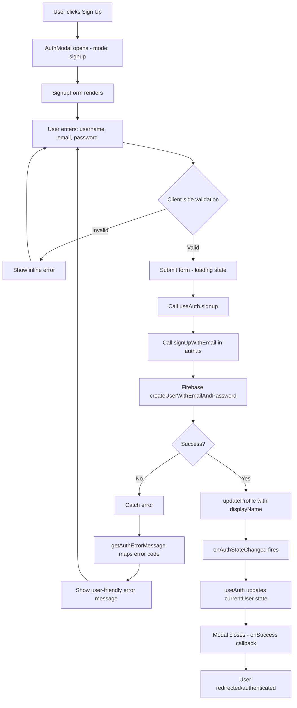
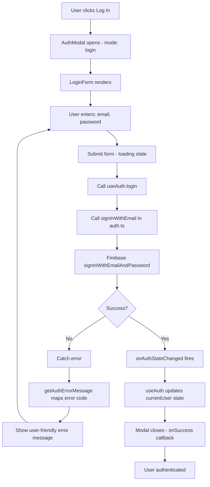
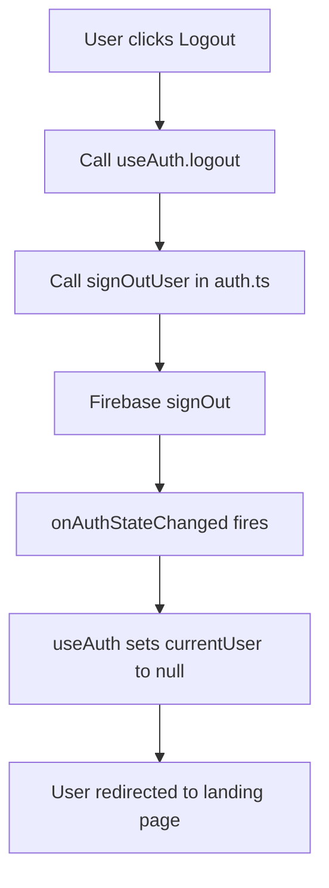

# Firebase Authentication System Documentation

**Last Updated:** 2025-10-16
**Purpose:** Document current Firebase Auth implementation for Stripe integration planning

---

## Overview

CollabCanvas uses Firebase Authentication for user management with email/password authentication. The auth system is built using React Context API for state management and provides signup, login, and logout functionality.

---

## Architecture

### Core Files

1. **`src/lib/firebase/auth.ts`** - Firebase Auth service layer
2. **`src/features/auth/hooks/useAuth.tsx`** - React Context & hook for auth state
3. **`src/features/auth/components/AuthModal.tsx`** - Modal dialog for auth
4. **`src/features/auth/components/LoginForm.tsx`** - Login form component
5. **`src/features/auth/components/SignupForm.tsx`** - Signup form component
6. **`src/features/auth/components/ProtectedRoute.tsx`** - Route protection wrapper

---

## Sign-Up Flow



### Step-by-Step Sign-Up Process

1. **User Initiates**: Clicks "Sign Up" button → `AuthModal` opens with `initialMode='signup'`
2. **Form Rendering**: `SignupForm` component displays with 3 fields:
   - Username (min 3 chars, required)
   - Email (type=email, required)
   - Password (min 6 chars, required)
3. **Client Validation**: On blur or submit:
   - Username length >= 3 characters
   - Valid email format (browser validation)
   - Password length >= 6 characters
   - Inline errors shown immediately
4. **Form Submission**:
   - Button disabled during loading
   - Button text changes: "Sign Up" → "Creating account..."
   - Error state cleared
5. **Firebase Request**: `signUpWithEmail(email, password, displayName)` called
   - Creates user with `createUserWithEmailAndPassword`
   - Updates profile with `updateProfile` to set `displayName`
6. **Success Path**:
   - Firebase `onAuthStateChanged` listener fires
   - User object created: `{ uid, email, username }`
   - `currentUser` state updated in `useAuth`
   - `onSuccess` callback closes modal
7. **Error Path**:
   - Error caught and passed to `getAuthErrorMessage`
   - Error code mapped to user-friendly message (see Error Messages section)
   - Error displayed in red banner below form
   - Form input preserved (not cleared)
   - Loading state reset

---

## Sign-In Flow



### Step-by-Step Sign-In Process

1. **User Initiates**: Clicks "Log In" button → `AuthModal` opens with `initialMode='login'`
2. **Form Rendering**: `LoginForm` component displays with 2 fields:
   - Email (type=email, required, autocomplete="email")
   - Password (type=password, required, autocomplete="current-password")
3. **Form Submission**:
   - Button disabled if email or password empty
   - Button text changes: "Log In" → "Logging in..."
   - Error state cleared
4. **Firebase Request**: `signInWithEmail(email, password)` called
5. **Success Path**:
   - Firebase `onAuthStateChanged` listener fires
   - `currentUser` state updated
   - Modal closes
6. **Error Path**:
   - Error caught and mapped to user-friendly message
   - Error displayed in red banner
   - Form input preserved

---

## Sign-Out Flow



---

## User Data Storage

### Firebase Auth Storage

User data is stored by Firebase Authentication in two locations:

1. **Firebase Auth Backend** (server-side):
   - `uid` (unique identifier)
   - `email`
   - `emailVerified` (always false currently)
   - `displayName` (username)
   - `createdAt` timestamp
   - `lastSignInTime`

2. **Browser IndexedDB** (client-side cache):
   - Path: DevTools → Application → IndexedDB → `firebaseLocalStorageDb`
   - Contains cached Firebase user object
   - Persists across sessions (unless cleared)

### Application State (useAuth)

Current user object in React state:

```typescript
interface User {
  uid: string;           // Firebase UID
  email: string | null;  // User email
  username: string | null; // Display name
}
```

**Note for Stripe Integration**: Currently, no Firestore user document exists. We'll need to create `/users/{userId}` documents in Firestore to store:
- Subscription status
- Stripe customer ID
- Project ownership
- Onboarding state

---

## Auth Loading States

### Initial Load

1. **App Mount**: `loading = true` (prevents flash of unauthenticated state)
2. **onAuthStateChanged fires**: `loading = false`
3. **Routes can now render** with correct auth state

### Form Submission

1. **Login Form**:
   - `loading = true` → Button disabled, text changes
   - Success/Error → `loading = false`

2. **Signup Form**:
   - `loading = true` → Button disabled, text changes
   - Validation before submission
   - Success/Error → `loading = false`

---

## Error Messages

The `getAuthErrorMessage` function maps Firebase error codes to user-friendly messages:

| Firebase Error Code | User-Friendly Message |
|---------------------|----------------------|
| `auth/email-already-in-use` | "This email is already registered" |
| `auth/invalid-email` | "Invalid email address" |
| `auth/operation-not-allowed` | "Email/password accounts are not enabled" |
| `auth/weak-password` | "Password should be at least 6 characters" |
| `auth/user-disabled` | "This account has been disabled" |
| `auth/user-not-found` | "No account found with this email" |
| `auth/wrong-password` | "Incorrect password" |
| `auth/invalid-credential` | "Invalid email or password" |
| `auth/too-many-requests` | "Too many failed attempts. Please try again later" |
| `auth/network-request-failed` | "Network error. Please check your connection" |
| *Default* | "Authentication failed. Please try again" |

**Error Display Pattern**:
- Shown inline below form fields
- Red text on light red background (`text-error-600 bg-error-50`)
- Appears within 200ms of error
- Does NOT clear form input
- User can immediately retry

---

## Auth State Management

### Context Provider Pattern

```typescript
// App.tsx wraps entire app
<AuthProvider>
  <App />
</AuthProvider>

// Any component can access auth state
const { currentUser, loading, login, signup, logout } = useAuth();
```

### Auth State Values

```typescript
interface AuthContextValue {
  currentUser: User | null;  // null when logged out
  loading: boolean;          // true during initial load
  login: (email: string, password: string) => Promise<void>;
  signup: (email: string, password: string, username: string) => Promise<void>;
  logout: () => Promise<void>;
}
```

---

## Protected Routes

**File**: `src/features/auth/components/ProtectedRoute.tsx`

Pattern for auth-protected routes:

```typescript
<Route
  path="/projects"
  element={
    <ProtectedRoute>
      <ProjectsPage />
    </ProtectedRoute>
  }
/>
```

Behavior:
- Shows loading spinner while `loading === true`
- Redirects to landing page if `currentUser === null`
- Renders children if authenticated

---

## Modal UX Patterns

### Mode Switching

Users can toggle between login and signup modes:

```typescript
// Bottom of AuthModal
{isLogin ? "Don't have an account?" : 'Already have an account?'}
<Button onClick={toggleMode}>
  {isLogin ? 'Sign up' : 'Log in'}
</Button>
```

### Modal Titles

- **Login Mode**: "Welcome Back" + "Log in to continue to your canvas"
- **Signup Mode**: "Create Account" + "Sign up to start collaborating"

### Form Accessibility

- All inputs have proper `<Label>` components
- Autocomplete attributes set (`email`, `current-password`, `new-password`)
- Error messages have semantic structure (not just color)
- Loading states disable form interaction

---

## Integration Points for Stripe

### Where to Add Subscription Logic

1. **After Signup Success** (in `useAuth.signup`):
   - Create Firestore user document: `/users/{uid}`
   - Set default subscription: `status: 'free'`
   - Initialize onboarding state

2. **On Auth State Change** (in `useAuth` effect):
   - Fetch user's Firestore document
   - Load subscription status
   - Update React state with subscription data

3. **Before Project Creation**:
   - Check `subscription.status`
   - If `status === 'free'` → Block creation, show upgrade prompt
   - If `status === 'founders' || 'pro'` → Allow creation

4. **Protected Route Enhancement**:
   - Current: Checks auth only
   - Future: Check auth + subscription tier
   - Example: `<SubscriptionProtectedRoute tier="founders">`

---

## Current Limitations & Future Enhancements

### Current State

- No Firestore user documents (only Firebase Auth)
- No subscription data stored
- No onboarding flow
- No email verification
- Username stored in `displayName` (not validated for uniqueness)

### Needed for Stripe Integration

1. **Create Firestore User Documents**:
   ```typescript
   /users/{userId}
     email: string
     username: string (unique)
     subscription: { status, stripeCustomerId, etc. }
     onboarding: { completedSteps, currentStep }
     createdAt: timestamp
     updatedAt: timestamp
   ```

2. **Extend AuthContext**:
   ```typescript
   interface AuthContextValue {
     currentUser: User | null;
     subscription: Subscription | null; // NEW
     loading: boolean;
     subscriptionLoading: boolean; // NEW
     // ... methods
   }
   ```

3. **Enhance User Type**:
   ```typescript
   interface User {
     uid: string;
     email: string | null;
     username: string | null;
     subscription?: Subscription; // NEW
   }
   ```

---

## Testing Checklist

### Sign-Up Flow

- [x] Sign up with new email → Success
- [x] Sign up with existing email → Error: "This email is already registered"
- [x] Sign up with weak password → Error: "Password should be at least 6 characters"
- [x] Sign up with username < 3 chars → Inline validation error
- [x] Submit button disabled while loading
- [x] Form input preserved on error

### Sign-In Flow

- [x] Login with valid credentials → Success
- [x] Login with wrong password → Error: "Invalid email or password"
- [x] Login with non-existent email → Error: "Invalid email or password"
- [x] Submit button disabled if email/password empty

### Auth State

- [x] Check IndexedDB → User data cached
- [x] Refresh page → User stays logged in
- [x] Logout → User data cleared

### Error Handling

- [x] Network error → "Network error. Please check your connection"
- [x] Too many requests → "Too many failed attempts"
- [x] All error messages are user-friendly (no technical jargon)

---

## Key Insights for Planning

1. **Error Handling is Robust**: 10+ error codes mapped to friendly messages
2. **Loading States Well-Defined**: Both initial load and form submission
3. **Validation is Client-Side Only**: Need to add server-side Firestore rules
4. **Username Not Unique**: Stored in `displayName`, not validated
5. **No Firestore Integration Yet**: Need to add user documents on signup
6. **Modal Pattern Works Well**: Can reuse for onboarding/upgrade flows

---

## Recommendations for Phase 4 (Database Setup)

1. **Create `/users/{userId}` on Signup**:
   - Add Cloud Function trigger on `onCreate` auth event
   - Or add logic in `useAuth.signup` after successful auth

2. **Add Subscription Field**:
   - Default all new users to `status: 'free'`
   - Include `stripeCustomerId: null` placeholder

3. **Enhance useAuth Hook**:
   - Fetch Firestore user doc after auth state change
   - Expose `subscription` in context

4. **Add Real-time Subscription Listener**:
   - Listen to `/users/{uid}` for subscription changes
   - Update UI immediately when webhook updates Firestore

---

**Documentation Complete**: Phase 0.1.1 ✓
