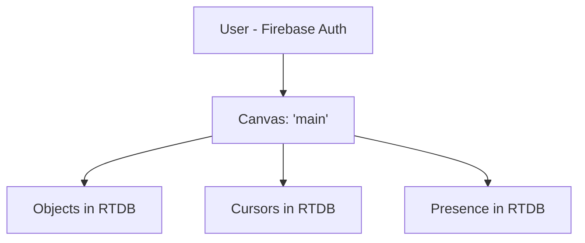
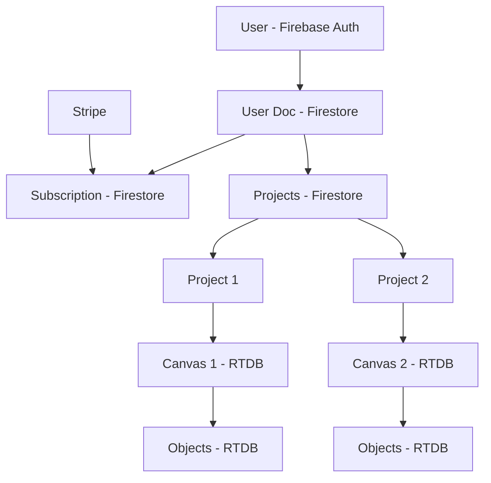
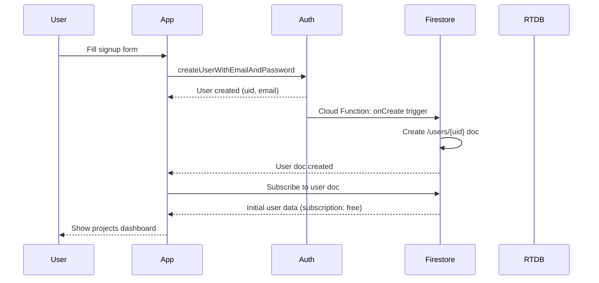
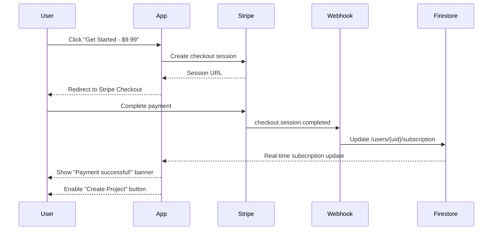
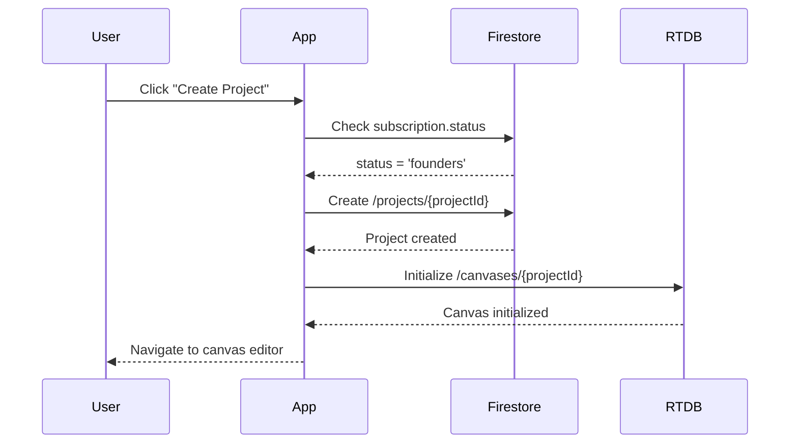

# Firebase Database Structure Documentation

**Last Updated:** 2025-10-16
**Purpose:** Document current Firestore and Realtime Database structure for Stripe integration planning

---

## Overview

CollabCanvas uses a hybrid Firebase database architecture:
- **Firestore**: Currently only used for re-exporting functions (no collections defined)
- **Realtime Database (RTDB)**: Primary data store for all canvas objects and real-time features

---

## Current Database Architecture

### Firebase Services Initialized

From `src/lib/firebase/config.ts`:

```typescript
{
  auth,           // Firebase Authentication
  firestore,      // Firestore (not actively used)
  realtimeDb,     // Realtime Database (primary data store)
  functions,      // Cloud Functions (for webhooks)
  storage,        // Cloud Storage (for image uploads)
}
```

### Development Emulators

All services use local emulators in development (`import.meta.env.DEV`):
- **Auth**: `localhost:9099`
- **Firestore**: `localhost:9150`
- **Realtime DB**: `localhost:9000`
- **Functions**: `localhost:5001`
- **Storage**: `localhost:9199`

---

## Realtime Database Structure

### Current Schema

```
/canvases
  /{canvasId}              // Currently hardcoded as 'main'
    /objects
      /{objectId}          // Auto-generated or custom ID
        id: string
        type: 'rectangle' | 'ellipse' | 'line' | 'text' | 'image' | 'group'
        x: number
        y: number
        width: number
        height: number
        rotation: number
        fill: string
        stroke: string
        strokeWidth: number
        opacity: number
        visible: boolean
        locked: boolean
        zIndex: number
        parentId: string | null
        isCollapsed: boolean
        createdBy: string (user ID)
        createdAt: timestamp
        updatedAt: timestamp
        [type-specific properties]

/cursors
  /{canvasId}              // Currently 'main'
    /{userId}
      x: number
      y: number
      username: string
      color: string
      lastUpdate: timestamp

/presence
  /{canvasId}              // Currently 'main'
    /{userId}
      username: string
      color: string
      online: boolean
      lastSeen: timestamp

/dragStates
  /{canvasId}              // Currently 'main'
    /{userId}
      objectId: string
      x: number
      y: number
      isDragging: boolean

/selections
  /{canvasId}              // Currently 'main'
    /{userId}
      objectIds: string[]
      lastUpdate: timestamp

/resizing
  /{canvasId}              // Currently 'main'
    /{userId}
      objectId: string
      width: number
      height: number
      isResizing: boolean

/textEditing
  /{canvasId}              // Currently 'main'
    /{userId}
      objectId: string
      isEditing: boolean
```

### Key Data Flow Characteristics

**Real-time Sync:**
- **Throttle Rate**: 50ms (20 updates/sec)
- **Target Latency**: <150ms total (50ms throttle + 50-100ms network)
- **Objects**: Full object subscription via `onValue()`
- **Cursors/Presence**: Individual user paths with `onDisconnect()` cleanup

**Atomic Operations:**
- Single object updates: `update()` (no full array replacement)
- Batch updates: Multi-path `update()` for group operations
- Z-index sync: Batch update all objects' zIndex in single operation

**Offline Support:**
- Firestore persistence enabled via `enableIndexedDbPersistence()`
- RTDB has built-in client-side caching

---

## Firestore Structure

### Current Usage

**Status**: Firestore is initialized but **NOT actively used** for data storage.

Current file (`src/lib/firebase/firestore.ts`) only re-exports Firestore functions:
```typescript
export {
  collection,
  doc,
  getDoc,
  getDocs,
  setDoc,
  updateDoc,
  deleteDoc,
  query,
  where,
  onSnapshot,
}
```

**No Firestore collections currently exist in the codebase.**

---

## Proposed Schema for Stripe Integration

### Firestore Collections (NEW)

Firestore is better suited for:
- User profile data (infrequent updates)
- Project metadata (ownership, permissions)
- Subscription data (Stripe integration)
- Denormalized public project listings

```typescript
/users/{userId}
  id: string
  email: string
  username: string (unique via Firestore rule)
  displayName: string
  photoURL: string | null
  subscription: {
    status: 'free' | 'founders' | 'pro'
    stripeCustomerId: string | null
    stripePriceId: string | null
    currentPeriodEnd: timestamp | null
    cancelAtPeriodEnd: boolean
  }
  onboarding: {
    completedSteps: string[]
    currentStep: number
    skipped: boolean
  }
  createdAt: timestamp
  updatedAt: timestamp
  lastLoginAt: timestamp

/projects/{projectId}
  id: string
  name: string (1-100 chars)
  ownerId: string (ref to /users/{userId})
  template: 'blank' | 'feature-graphic' | 'app-icon'
  isPublic: boolean
  collaborators: string[] (user IDs)
  canvasId: string (ref to RTDB /canvases/{canvasId})
  createdAt: timestamp
  updatedAt: timestamp
  thumbnail: string | null (base64 or Storage URL)
  objectCount: number (denormalized)

/public-projects/{projectId} (denormalized for fast queries)
  projectId: string (ref to /projects/{projectId})
  name: string
  ownerId: string
  ownerUsername: string
  thumbnail: string | null
  updatedAt: timestamp
  objectCount: number

/config/founders-deal
  spotsTotal: 10
  spotsRemaining: number
  priceId: string (Stripe price ID)
  active: boolean
  updatedAt: timestamp
```

### Hybrid Architecture (Firestore + RTDB)

**Firestore** (for metadata, permissions, subscriptions):
- `/users` - User profiles and subscription data
- `/projects` - Project metadata and ownership
- `/public-projects` - Denormalized public project listings
- `/config` - App configuration (founders deal, etc.)

**Realtime Database** (for real-time collaboration):
- `/canvases/{canvasId}/objects` - Canvas objects (continues existing pattern)
- `/canvases/{canvasId}/cursors` - User cursors
- `/canvases/{canvasId}/presence` - User presence
- `/canvases/{canvasId}/dragStates` - Drag states
- `/canvases/{canvasId}/selections` - Selection states
- `/canvases/{canvasId}/resizing` - Resize states
- `/canvases/{canvasId}/textEditing` - Text editing states

**Why Hybrid?**
- **Firestore**: Complex queries, indexing, user/project metadata
- **RTDB**: Real-time updates (<150ms), per-field updates, presence tracking
- **Best of both**: Firestore for structure, RTDB for speed

---

## Data Relationships

### Current (Single Canvas)



### Future (Multi-Project with Stripe)



**Key Relationships:**
- **User 1:1 Subscription** - Each user has one subscription record
- **User 1:N Projects** - Users can own multiple projects (if paid)
- **Project 1:1 Canvas** - Each project has one canvas in RTDB
- **Project N:M Collaborators** - Projects can have multiple collaborators

---

## Migration Path

### Phase 1: Add Firestore Collections (No Breaking Changes)

1. **Create `/users` collection**:
   - Trigger: Cloud Function on `onCreate` auth event
   - Create user doc with default `subscription.status = 'free'`
   - Copy `displayName` from Firebase Auth

2. **Create `/projects` collection**:
   - Initially empty (no projects yet)
   - Add during Phase 3 (Projects Dashboard)

3. **Update `useAuth` hook**:
   - Fetch Firestore user doc after auth state change
   - Subscribe to user doc for real-time subscription updates
   - Expose `subscription` in context

### Phase 2: Migrate Canvas ID from 'main' to Dynamic

1. **Update all RTDB paths**:
   - Change: `/canvases/main/objects`
   - To: `/canvases/${projectId}/objects`

2. **Update `realtimeCanvasService.ts`**:
   - All functions accept `canvasId` parameter (already implemented)
   - Replace hardcoded 'main' with project-based ID

3. **Backward compatibility**:
   - Keep existing 'main' canvas for demo/onboarding
   - Map to "Getting Started" demo project

---

## Current Limitations & Needed Changes

### Limitations

1. **No User Documents**: User data only in Firebase Auth (no Firestore user docs)
2. **Hardcoded Canvas ID**: All paths use 'main' (need dynamic project IDs)
3. **No Project Ownership**: No concept of who owns what
4. **No Access Control**: Anyone can edit 'main' canvas
5. **No Subscription Data**: No way to track free vs paid users
6. **Firestore Unused**: Initialized but not leveraged

### Changes Needed for Stripe Integration

#### 1. Create Firestore User Documents

**When:** After user signs up (Cloud Function trigger)

```typescript
// Cloud Function: onCreate auth trigger
import { initializeApp } from 'firebase-admin/app';
import { getFirestore } from 'firebase-admin/firestore';

export const createUserDocument = functions.auth.user().onCreate(async (user) => {
  const firestore = getFirestore();

  await firestore.collection('users').doc(user.uid).set({
    id: user.uid,
    email: user.email,
    username: user.displayName || `user_${user.uid.slice(0, 8)}`,
    displayName: user.displayName,
    photoURL: user.photoURL,
    subscription: {
      status: 'free',
      stripeCustomerId: null,
      stripePriceId: null,
      currentPeriodEnd: null,
      cancelAtPeriodEnd: false,
    },
    onboarding: {
      completedSteps: [],
      currentStep: 0,
      skipped: false,
    },
    createdAt: FieldValue.serverTimestamp(),
    updatedAt: FieldValue.serverTimestamp(),
    lastLoginAt: FieldValue.serverTimestamp(),
  });
});
```

#### 2. Update useAuth Hook

**Extend context with subscription data:**

```typescript
interface AuthContextValue {
  currentUser: User | null;
  subscription: Subscription | null; // NEW
  loading: boolean;
  subscriptionLoading: boolean; // NEW
  login: (email: string, password: string) => Promise<void>;
  signup: (email: string, password: string, username: string) => Promise<void>;
  logout: () => Promise<void>;
  refreshSubscription: () => Promise<void>; // NEW
}
```

**Subscribe to Firestore user doc:**

```typescript
React.useEffect(() => {
  if (!currentUser) return;

  const userDocRef = doc(firestore, 'users', currentUser.uid);
  const unsubscribe = onSnapshot(userDocRef, (snapshot) => {
    if (snapshot.exists()) {
      const data = snapshot.data();
      setSubscription(data.subscription);
    }
  });

  return unsubscribe;
}, [currentUser]);
```

#### 3. Add Firestore Security Rules

```javascript
rules_version = '2';
service cloud.firestore {
  match /databases/{database}/documents {

    // Users can only read/write their own document
    match /users/{userId} {
      allow read: if request.auth != null && request.auth.uid == userId;
      allow write: if request.auth != null && request.auth.uid == userId;
    }

    // Projects readable by owner and collaborators
    match /projects/{projectId} {
      allow read: if request.auth != null && (
        resource.data.ownerId == request.auth.uid ||
        request.auth.uid in resource.data.collaborators ||
        resource.data.isPublic == true
      );
      allow create: if request.auth != null &&
        get(/databases/$(database)/documents/users/$(request.auth.uid)).data.subscription.status in ['founders', 'pro'];
      allow update, delete: if request.auth != null && resource.data.ownerId == request.auth.uid;
    }

    // Public projects readable by anyone
    match /public-projects/{projectId} {
      allow read: if true;
      allow write: if false; // Only writable via Cloud Function
    }

    // Config readable by all authenticated users
    match /config/{doc} {
      allow read: if request.auth != null;
      allow write: if false; // Only writable via admin
    }
  }
}
```

#### 4. Add RTDB Security Rules

```json
{
  "rules": {
    "canvases": {
      "$canvasId": {
        ".read": "auth != null",
        ".write": "auth != null",
        "objects": {
          ".indexOn": ["zIndex", "parentId"]
        }
      }
    }
  }
}
```

---

## Data Flow Examples

### Example 1: New User Signup



### Example 2: Stripe Payment Success



### Example 3: Create New Project (Paid User)



---

## Performance Considerations

### Firestore Query Optimization

**Denormalized Public Projects**:
- Store public projects in `/public-projects` collection
- Avoids need to query all projects and filter
- Update via Cloud Function when project.isPublic changes

**Composite Indexes** (auto-created by Firestore):
- `/projects` ordered by `updatedAt` descending
- `/projects` where `ownerId == userId` ordered by `createdAt`
- `/public-projects` ordered by `updatedAt` descending

### RTDB Optimization

**Already Optimized**:
- Per-object updates (not full array replacement)
- Batch updates for group operations
- 50ms throttle on all real-time updates
- zIndex stored on each object for efficient sorting

**Index On**:
- `zIndex` - For efficient sorting
- `parentId` - For hierarchy queries

---

## Testing Checklist

### Firestore

- [ ] Create user document on signup
- [ ] User document has default subscription (status: 'free')
- [ ] User can read their own document
- [ ] User cannot read other users' documents
- [ ] Subscription updates propagate in real-time

### RTDB

- [ ] Canvas objects sync with 50ms throttle
- [ ] Multi-user cursor positions update in real-time
- [ ] Presence shows who's online
- [ ] Offline persistence works (Firestore)
- [ ] Z-index syncs correctly on reorder

### Integration

- [ ] Auth user → Firestore user doc created
- [ ] Stripe webhook → Subscription updated
- [ ] Subscription change → UI updates in <200ms
- [ ] Project creation blocked for free users
- [ ] Project creation works for paid users

---

## Key Insights for Planning

1. **Firestore is Ready**: Already initialized, just need to add collections
2. **RTDB Works Great**: Keep for real-time collaboration, no changes needed
3. **Hybrid is Best**: Firestore for metadata, RTDB for real-time
4. **Canvas ID Migration**: Replace 'main' with dynamic project IDs
5. **Security Rules Critical**: Must implement before production
6. **Cloud Functions Needed**:
   - Create user doc on signup
   - Update subscription on Stripe webhook
   - Denormalize public projects
7. **Offline Support**: Firestore persistence already enabled

---

## Recommendations for Phase 4 (Database Setup)

1. **Create Firestore Collections**:
   - Implement Cloud Function for user creation
   - Add Firestore security rules
   - Test with emulator first

2. **Update useAuth Hook**:
   - Subscribe to Firestore user doc
   - Expose subscription data in context
   - Add loading states for subscription fetch

3. **Add Type Definitions**:
   - Create `src/types/subscription.types.ts`
   - Create `src/types/project.types.ts`
   - Update User type to include subscription

4. **Migration Strategy**:
   - Keep 'main' canvas for backward compatibility
   - New projects get unique canvas IDs
   - Gradually migrate demo content

---

**Documentation Complete**: Phase 0.1.2 ✓
